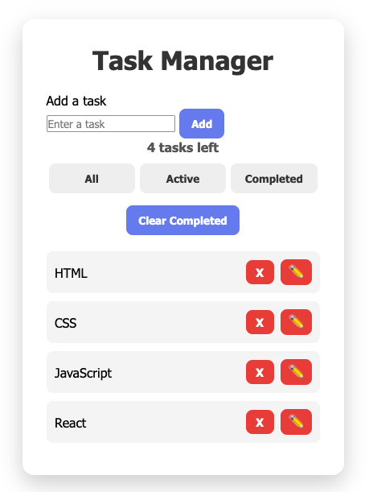

# 🧠 Task Manager App

A responsive task manager built using vanilla JavaScript, focused on real-world front-end development concepts such as state management, DOM manipulation, and user experience.

---

## 🚀 Features

- Add, edit, and delete tasks
- Mark tasks as complete
- Filter tasks (All / Active / Completed)
- Clear completed tasks
- Persistent storage using LocalStorage
- Empty state UI ("No tasks yet")
- Input validation (disable add button when empty)
- Smooth animations and transitions

---

## 🛠️ Tech Stack

- HTML
- CSS
- JavaScript (ES6+)
- LocalStorage API

---

## 🧠 What I Learned

- How to manage application state using JavaScript
- DOM manipulation and dynamic UI updates
- Handling events and form submissions
- Structuring code using functions (separation of concerns)
- Improving user experience with validation and animations

---

## 📸 Preview

## 👩‍💻 Author

Grace – Full-Stack Developer
